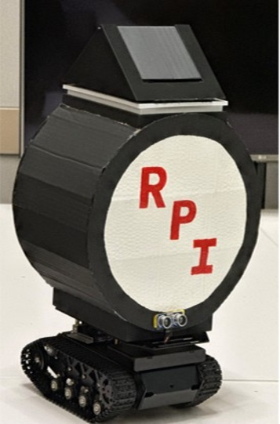
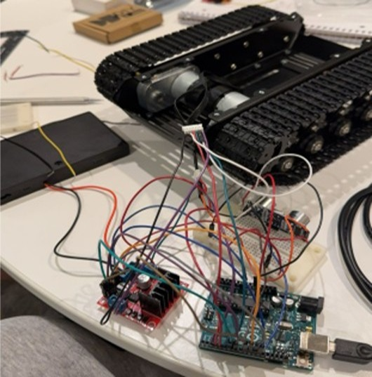

# Autonomous Mobile Service Robot (Systems Engineering Prototype)
**Role:** Systems Integrator & Firmware Developer | **Platform:** Arduino Mega (C++)

*(Phase 3: Final deployed prototype with custom enclosure for campus environments)*

## 1. Project Overview
This project executed the full **Systems Engineering V-Model** to design, build, and validate an autonomous mobile robot. The system bridges low-level embedded control (interrupts, PWM) with high-level path planning logic to execute navigation tasks while maintaining active safety protocols.

## 2. System Architecture
The robot utilizes a **Differential Drive** kinematics model controlled by an **Arduino Mega 2560**.
* **Actuation:** Dual DC Motors via L298N H-Bridge Driver
* **Feedback:** Magnetic Hall-Effect Encoders (Interrupt-driven odometry)
* **Perception:** Ultrasonic Sensor (HC-SR04) for obstacle detection
* **Power:** 12V DC Independent Power Supply (8xAA Array) for mobile autonomy

*(Phase 1: Electrical subsystem integration and signal validation)*

## 3. Technical Implementation
### A. Interrupt-Driven Odometry
To ensure precise position tracking without blocking the main execution loop, I implemented hardware interrupts for the encoders
* **Mechanism:** `attachInterrupt()` captures rising/falling edges on Pins 2 & 3
* **Logic:** A custom state check `checkObstacle()` runs asynchronously to motion, ensuring safety takes priority over path execution

### B. Feedback Control Loop
Implemented a **Proportional (P) Controller** to correct heading drift in real-time.
* **Error Calculation:** `error = right_ticks - left_ticks`
* **Correction:** Dynamically adjusts PWM duty cycle (`analogWrite`) to synchronize wheel velocities
* *See `driveForward()` function in `RoboCan_StartStop.ino`*

### C. Safety Architecture (ISO 13482 Inspired)
The system features a "Safety Override" layer that preempts navigation commands.
* **Obstacle-Dependent Hysteresis:** Implemented a 'Stop-and-Wait' state machine. Upon detecting an obstacle (<20cm), the system enters a holding state until the path clears, preventing oscillation or collision
* **Recovery:** System enters a "Wait & Scan" state before attempting path re-calculation

## 4. Systems Engineering Process (V-Model)
1.  **Requirements Analysis:** defined "No-Collision" zones and navigation accuracy metrics (<5% drift)
2.  **Subsystem Design:** Selected Arduino Mega for its high interrupt count (6 hardware interrupts) to handle dual encoders
3.  **Integration:** Breadboard prototyping to validate H-Bridge logic levels
4.  **System Validation:** Verified kinematic fidelity via a multi-stage waypoint test (Forward $\to$ 90° Turn $\to$ Half-Distance $\to$ 180° Pivot). Performed stress testing on inclined surfaces to validate torque sufficiency and center-of-gravity stability (tipping analysis)

## 5. Media
[Link to Demo Video](https://github.com/user-attachments/assets/c3757b37-e308-423b-8d45-2012a37088b3)